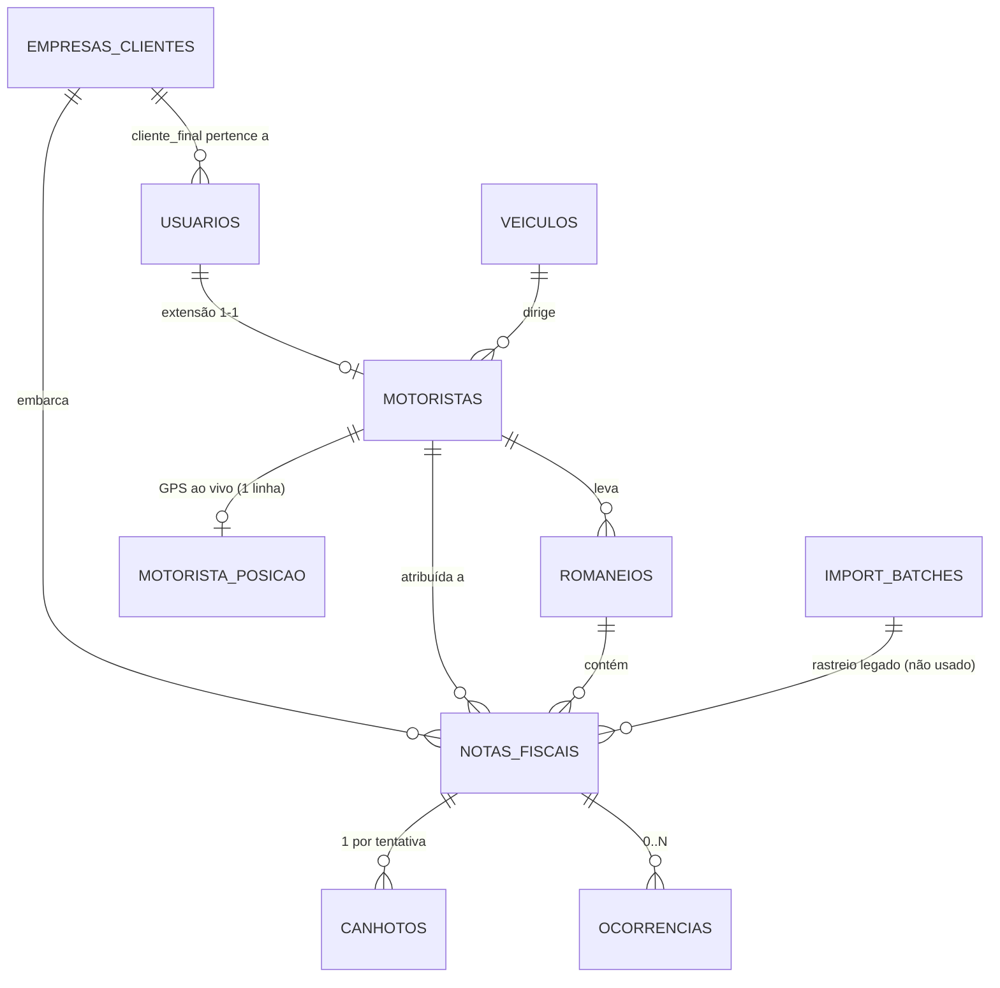

# 09 — Schema do Banco, reconstruído das 22 Migrations

**Método:** li as 22 migrations por extenso (não só os nomes) e reconstruí o estado **atual** de cada
tabela — várias colunas de 0001 foram removidas/alteradas depois (ex.: `status` perdeu `'retida'` em
0008). Onde uma migration foi revertida por outra (`uq_canhoto_nf` criado em 0009, dropado em 0016), o
schema abaixo reflete o estado final, com nota de histórico.

## Diagrama de relacionamento

## `empresas_clientes`
| Coluna | Tipo | Notas |
|---|---|---|
| `id` | uuid PK | `gen_random_uuid()` |
| `nome` | text not null | |
| `cnpj` | text | |
| `contato_nome`, `contato_email` | text | |
| `ativo` | boolean not null default true | |
| `created_at` | timestamptz | |
| `legacy_source`, `legacy_id` | text | 0013 — rastreio de importação de legado |
| `import_batch_id` | uuid → `import_batches(id)` | 0013 |

Índice único `(legacy_source, legacy_id) where legacy_id is not null` (0013).

## `usuarios`
| Coluna | Tipo | Notas |
|---|---|---|
| `id` | uuid PK → `auth.users(id)` on delete cascade | Espelha o Auth do Supabase |
| `nome` | text not null | |
| `email` | text | |
| `role` | text not null check (`gerencia`,`motorista`,`cliente_final`) | **Também** replicado em `app_metadata` do JWT — é a cópia do JWT que a RLS de fato usa (`jwt_role()`), não esta coluna |
| `empresa_id` | uuid → `empresas_clientes(id)` | só populado para `cliente_final` |
| `ativo` | boolean not null default true | |
| `created_at` | timestamptz | |
| `legacy_source`, `legacy_id`, `import_batch_id` | — | 0013 |

## `veiculos`
`id` uuid PK · `placa` text not null **unique** · `tipo` text · `ativo` boolean default true · `created_at`. Sem colunas de legado (0013 não tocou esta tabela).

## `motoristas` — extensão 1-1 de `usuarios`
`id` uuid PK → `usuarios(id)` on delete cascade · `telefone` text · `cnh` text · `veiculo_id` uuid → `veiculos(id)` · `created_at` · `legacy_source`/`legacy_id`/`import_batch_id` (0013).

## `romaneios`
| Coluna | Tipo | Notas |
|---|---|---|
| `id` | uuid PK | |
| `data` | date not null default `current_date` | **Não** usa `hoje_sp()` — só as policies de RLS e `notas_fiscais.data_entrega` foram corrigidas para fuso de SP (0010); esta coluna nunca precisou porque `criarRomaneio` grava a partir do app, que já calcula em SP |
| `motorista_id` | uuid → `motoristas(id)` | |
| `veiculo_id` | uuid → `veiculos(id)` | |
| `criado_por` | uuid → `usuarios(id)` | |
| `status` | text not null default `'rascunho'` check (`rascunho`,`ativo`,`fechado`) | |
| `confirmado_em` | timestamptz | Setado quando o motorista confirma recebimento |
| `fechado_em` | timestamptz | |
| `created_at` | timestamptz | |

Nenhuma coluna adicionada depois de 0001 — é a tabela mais estável do schema.

## `notas_fiscais` — a mais evoluída (7 migrations a alteraram)
| Coluna | Tipo | Desde | Notas |
|---|---|---|---|
| `id` | uuid PK | 0001 | |
| `romaneio_id` | uuid → `romaneios(id)` on delete **set null** | 0001 | NF sobrevive à exclusão do romaneio |
| `numero_nf` | text not null | 0001 | |
| `empresa_cliente_id` | uuid **not null** → `empresas_clientes(id)` | 0001 | |
| `destinatario_nome`, `destinatario_endereco` | text not null | 0001 | |
| `cidade` | text | 0001 | |
| `motorista_id` | uuid → `motoristas(id)` | 0001 | **Nullable** — NF "solta" não tem motorista (estado normal desde A-007) |
| `data_entrega` | date not null default `current_date` | 0001 | |
| `ordem` | int | 0001 | Sequência de rota — Fase B, não usado ainda (sem TSP/VRP implementado) |
| `status` | text not null default `'pendente'` check (`pendente`,`em_rota`,`aceita`,`recusada`,`ocorrencia`) | 0001, check alterado em 0008 | `'retida'` existia originalmente, virou tipo de ocorrência em 0008. Desde 0022, `status` reflete o **desfecho real** da última tentativa (antes, 0016 achatava tudo que não era `aceita` em `pendente`) |
| `foto_url` | text | 0001 | |
| `entregue_em` | timestamptz | 0001 | |
| `observacao` | text | 0001 | |
| `created_at`, `updated_at` | timestamptz | 0001 | `updated_at` automático via trigger `trg_nf_updated` |
| `chave_acesso` | text check (regex 44 dígitos) | 0005 | Chave de acesso da NF-e — índice único parcial quando não nulo |
| `origem_importacao` | text not null default `'gerencia'` check (`gerencia`,`cliente`) | 0008 | |
| `importado_em` | timestamptz not null default now() | 0008 | |
| `legacy_source`, `legacy_id`, `import_batch_id` | — | 0013 | |
| `lat`, `lng` | double precision | 0014 | Geocodificação do **endereço de entrega** — distinto do GPS do canhoto |
| `geocode_status` | text check (`ok`,`falhou`) | 0014 | |
| `geocoded_em` | timestamptz | 0014 | |
| `geocode_erro` | text | 0019 | Motivo da falha — permite retry direcionado |

**`NF_STATUS_FINAIS` = apenas `['aceita']`** (`lib/types.ts`) — reflexo direto da regra de negócio A-007/0016: nenhum outro status encerra a NF.

## `canhotos`
| Coluna | Tipo | Desde | Notas |
|---|---|---|---|
| `id` | uuid PK | 0001 | |
| `nota_fiscal_id` | uuid not null → `notas_fiscais(id)` on delete cascade | 0001 | |
| `motorista_id` | uuid not null → `motoristas(id)` | 0001 | |
| `foto_url` | text | 0001 | |
| `status` | text not null check (`aceita`,`recusada`,`ocorrencia`) | 0001, check alterado 0008 | |
| `registrado_em` | timestamptz not null default now() | 0001 | |
| `sincronizado` | boolean not null default true | 0001 | `false` = veio de sync offline (não observei código que de fato grave `false` — parece não usado na prática) |
| `client_id` | text | 0001 | Chave de idempotência da tentativa |
| `created_at` | timestamptz | 0001 | |
| `lat`, `lng`, `gps_precisao` | double precision / real | 0005 | GPS **pontual** do momento do registro (best-effort) |
| `observacao` | text | 0016 | Observação livre **por tentativa** — antes só existia `notas_fiscais.observacao` (um valor só, a 2ª tentativa sobrescrevia a 1ª) |
| `foto_chegada_url` | text | 0018 | Segunda foto obrigatória (A-010), mesma linha/tentativa |

**Histórico de índice único (mudou de sentido 2x):**
1. 0001: `uq_canhoto_client_id` **parcial** (`where client_id is not null`)
2. 0006: trocado para **não-parcial** — o parcial quebrava `ON CONFLICT (client_id)` do Supabase upsert (erro 500 real em produção)
3. 0009: **mais um índice**, `uq_canhoto_nf` — no máximo 1 canhoto por NF (pré-A-007)
4. 0016: `uq_canhoto_nf` **dropado** — A-007 permite múltiplas tentativas por NF. Só `uq_canhoto_client_id` restou, e é ele quem garante idempotência por tentativa, não mais por NF.

## `ocorrencias`
`id` uuid PK · `nota_fiscal_id` uuid not null → `notas_fiscais(id)` on delete cascade · `tipo` text not null check (`item_faltando`,`endereco_nao_encontrado`,`cliente_ausente`,`avaria`,`canhoto_retido`†,`outro`) · `descricao` text · `created_at` · `client_id` text‡ + índice único não-parcial `uq_ocorrencia_client_id`.

† `canhoto_retido` adicionado em 0008 (migração do antigo status `'retida'`). ‡ `client_id` adicionado em 0009 para idempotência simétrica à de `canhotos`.

## `import_batches` (0013) — esqueleto nunca usado em produção
`id` uuid PK · `origem` text not null · `arquivo` text · `hash_sha256` text · `iniciado_em`/`concluido_em` timestamptz · `total_origem`/`total_importado`/`total_rejeitado` int · `status` text default `'em_andamento'` check (`em_andamento`,`concluido`,`revertido`,`falhou`) · `relatorio` jsonb · `criado_por` uuid → `usuarios(id)` · `created_at`. Ver `18_KNOWN_ISSUES_AND_RISKS.md`.

## `motorista_posicao` (0017)
`motorista_id` uuid **PK** → `motoristas(id)` on delete cascade (1 linha por motorista — upsert, nunca histórico) · `lat`/`lng` double precision not null · `atualizado_em` timestamptz not null default now() — **sempre** setado pelo trigger `motorista_posicao_touch()`, nunca confia no relógio do celular.

## Funções auxiliares de RLS/JWT (não são tabelas, mas são infraestrutura de schema)

| Função | Desde | Assinatura | Papel |
|---|---|---|---|
| `jwt_role()` | 0002 | `() returns text` | Lê `app_metadata.role` do JWT |
| `jwt_empresa_id()` | 0002 | `() returns uuid` | Lê `app_metadata.empresa_id` do JWT |
| `touch_updated_at()` | 0001 | trigger | `notas_fiscais.updated_at` |
| `hoje_sp()` | 0010 | `() returns date` | Dia-calendário de São Paulo — usado por RLS e app |
| `nf_guard_motorista()` | 0009, reescrita 0016 | trigger | Imutabilidade + whitelist de colunas editáveis pelo motorista |
| `registrar_entrega_offline(...)` | 0011, reescrita 0016/0018/0022 | RPC `security invoker` | Ver `11_OFFLINE_SYNC_PIPELINE_FROM_CODE.md` |
| `motorista_posicao_touch()` | 0017 | trigger | Cronometra `atualizado_em` no servidor |
| `motorista_registrou_nf(uuid)` | 0021 | `() returns boolean`, **`security definer`** | Quebra recursão de RLS — ver `10_RLS_AND_SECURITY.md` |

## Storage

Bucket `canhotos` (privado, criado em 0003). Endurecido em 0012: `file_size_limit = 5MB`, `allowed_mime_types = ['image/jpeg','image/webp']`, path obrigatório `{motorista_id}/{nf_id}/{client_id}.jpg` para motorista (policy `canhotos_insert_motorista` exige 1º segmento do path = `auth.uid()`). Sem policy de `UPDATE` (removida explicitamente em 0007) — canhoto é imutável também no Storage, não só na tabela.

## Realtime

Tabelas na publicação `supabase_realtime`: `notas_fiscais`, `canhotos`, `romaneios` (0004) + `motorista_posicao` (0017). `usuarios`, `ocorrencias`, `empresas_clientes` **não** têm Realtime habilitado.

## Cronologia completa das 22 migrations

| # | Resumo de uma linha |
|---|---|
| 0001 | Schema base — 8 tabelas centrais |
| 0002 | RLS em tudo + `jwt_role()`/`jwt_empresa_id()` |
| 0003 | Bucket `canhotos` (privado) |
| 0004 | Realtime em `notas_fiscais`/`canhotos`/`romaneios` |
| 0005 | `chave_acesso` (NF) + GPS pontual (canhoto) |
| 0006 | Índice de `client_id` parcial → não-parcial (corrige 500 no sync) |
| 0007 | Remove policy de UPDATE do Storage (reforça imutabilidade) |
| 0008 | `'retida'` vira ocorrência; cliente pode importar; rastreio de origem |
| 0009 | Sync idempotente + imutabilidade + RLS restrita do motorista |
| 0010 | `hoje_sp()` — RLS alinhada ao fuso de SP |
| 0011 | `registrar_entrega_offline()` — transação única |
| 0012 | Storage endurecido (path/tamanho/MIME) |
| 0013 | `import_batches` + colunas de legado (esqueleto) |
| 0014 | Geocodificação do endereço da NF |
| 0015 | Motorista vê histórico completo, não só hoje |
| 0016 | A-007 — múltiplas tentativas por NF |
| 0017 | `motorista_posicao` — GPS ao vivo |
| 0018 | `foto_chegada_url` — segunda foto obrigatória |
| 0019 | `geocode_erro` — motivo recuperável |
| 0020 | RLS: motorista ganha SELECT em `ocorrencias` (corrige 500 real) |
| 0021 | RLS: motorista vê NF que registrou, mesmo sem ser mais dele (corrige 500 real) |
| 0022 | NF passa a guardar o desfecho real da tentativa, não sempre `'pendente'` |
