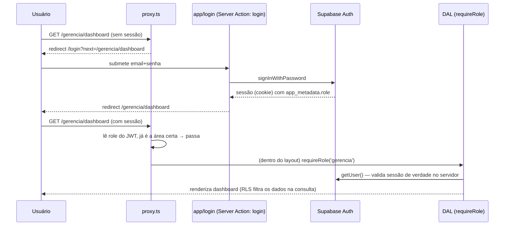

# 12 — Autenticação e Autorização

Ver também `05_ARCHITECTURE_FROM_CODE.md` (visão geral das 3 camadas) e `10_RLS_AND_SECURITY.md` (a camada 3 em detalhe). Este arquivo cobre as camadas 1 e 2 — roteamento e checagem de sessão.

## Mecanismo de autenticação

Supabase Auth, email+senha direto — **sem OAuth/terceiros** (nenhum provider social encontrado em `lib/supabase/`). Sessão via cookies (`@supabase/ssr`), não localStorage — necessário para Server Components lerem a sessão no servidor.

## Os 3 roles — fixos, sem hierarquia, sem permissões compostas

```ts
// lib/types.ts
export type Role = "gerencia" | "motorista" | "cliente_final";
```

Não é RBAC granular (não existem "permissões" separadas de "roles") — é role simples, 1 papel por usuário, sem composição. `gerencia` não é "admin de tudo mais outras coisas" — é um papel só, com RLS que dá acesso total (`ger_all` for all).

**Onde o role mora, e por que duas cópias:**
1. `usuarios.role` (coluna no Postgres) — legível pela própria gerência via `ger_all`
2. `auth.users.app_metadata.role` (dentro do JWT) — **é esta cópia que toda checagem de verdade usa** (`jwt_role()` na RLS, `proxy.ts`, `dal.ts`)

A cópia no JWT é a que importa porque só quem tem a **service role key** consegue escrevê-la (`lib/supabase/admin.ts`, na criação do login) — o próprio usuário autenticado não pode alterar seu `app_metadata` por nenhum caminho normal do Supabase Auth. Isso é o que torna `jwt_role()`/`jwt_empresa_id()` seguros de usar dentro de policies RLS: não há como o cliente forjar um role mais privilegiado adulterando o próprio token.

## Camada 1 — `proxy.ts` (roteamento otimista)

Next.js 16 renomeou `middleware.ts` → `proxy.ts` (mesma função, arquivo na raiz, export `proxy` em vez de `middleware`) — **não recriar `middleware.ts`**, não existe mais nesta versão (`AGENTS.md` do `create-next-app` avisa disso).

Responsabilidades, nesta ordem:
1. `updateSession()` — refresh do token Supabase a cada request
2. Não autenticado + rota não-pública → redireciona para `/login?next=<rota>`
3. Autenticado visitando `/` ou `/login` → redireciona para a home do role (`ROLE_HOME`)
4. Autenticado tentando acessar área de **outro** role (`ROLE_AREA`) → redireciona para a própria home

**"Otimista" quer dizer:** lê o role direto do JWT decodificado, **sem** ir ao banco — existe para UX (evitar flash de tela errada antes do redirect), não é a autorização de verdade. `config.matcher` explicitamente exclui `/api/*` — rotas de API tratam auth internamente e devem responder JSON, nunca redirect de HTML.

## Camada 2 — `lib/auth/dal.ts` (checagem segura no servidor)

```ts
export const getSessionUser = cache(async (): Promise<SessionUser | null> => { ... })
export async function requireUser(): Promise<SessionUser>   // redireciona pra /login se não autenticado
export async function requireRole(role: Role): Promise<SessionUser>  // redireciona pra home do role se for outro
```

`cache()` do React memoiza por render — chamar `requireRole` em múltiplos Server Components na mesma árvore não bate o Supabase Auth múltiplas vezes. Cada `layout.tsx` de área (`app/gerencia/layout.tsx`, `app/motorista/layout.tsx`, `app/cliente/layout.tsx`) chama `requireRole(...)` uma vez — todo Server Component dentro herda a garantia.

**Por que isso ainda não é "autorização de dados"**, só "autorização de tela": `requireRole('gerencia')` garante que quem está vendo `/gerencia/dashboard` é gerência — mas não filtra **quais** linhas de `notas_fiscais` aparecem. Isso é 100% RLS (camada 3).

## `lib/supabase/admin.ts` — a chave que ignora tudo

Usa `SUPABASE_SERVICE_ROLE_KEY` — **ignora RLS por completo**. Único uso encontrado: criação de login (`cadastros/actions.ts: criarMotorista` e afins), que precisa inserir em `auth.users` com privilégio que nenhum role de app tem. Regra do projeto (`CLAUDE.md`): nunca deve ser chamado fora do servidor, nunca exposto ao browser — confirmado, não há import de `admin.ts` em nenhum arquivo `"use client"`.

## Fluxo de login → primeira tela



## O que NÃO existe

- Sem 2FA/MFA
- Sem "esqueci minha senha" no app (não encontrado em `app/` — provavelmente feito manualmente pela gerência/admin no painel do Supabase)
- Sem expiração de sessão customizada além do padrão do Supabase Auth
- Sem rate limiting de tentativa de login no código do app (pode existir no nível do Supabase, não verificável a partir deste repositório)
