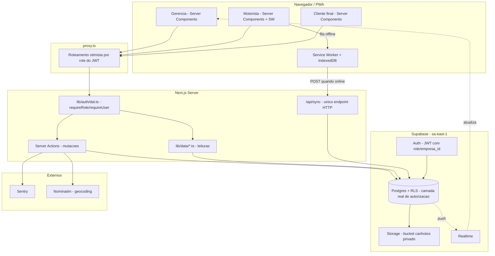
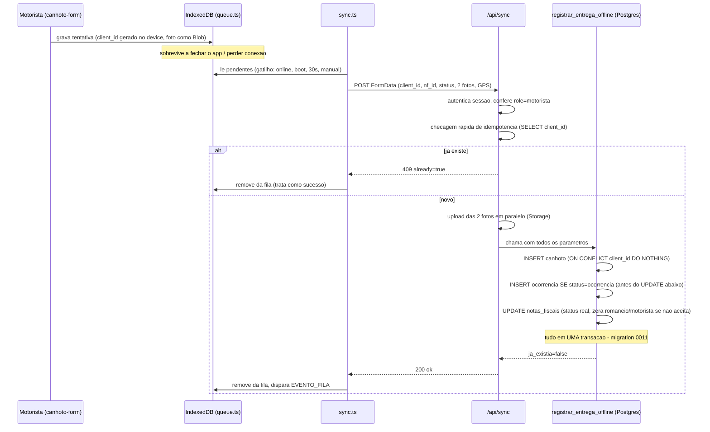
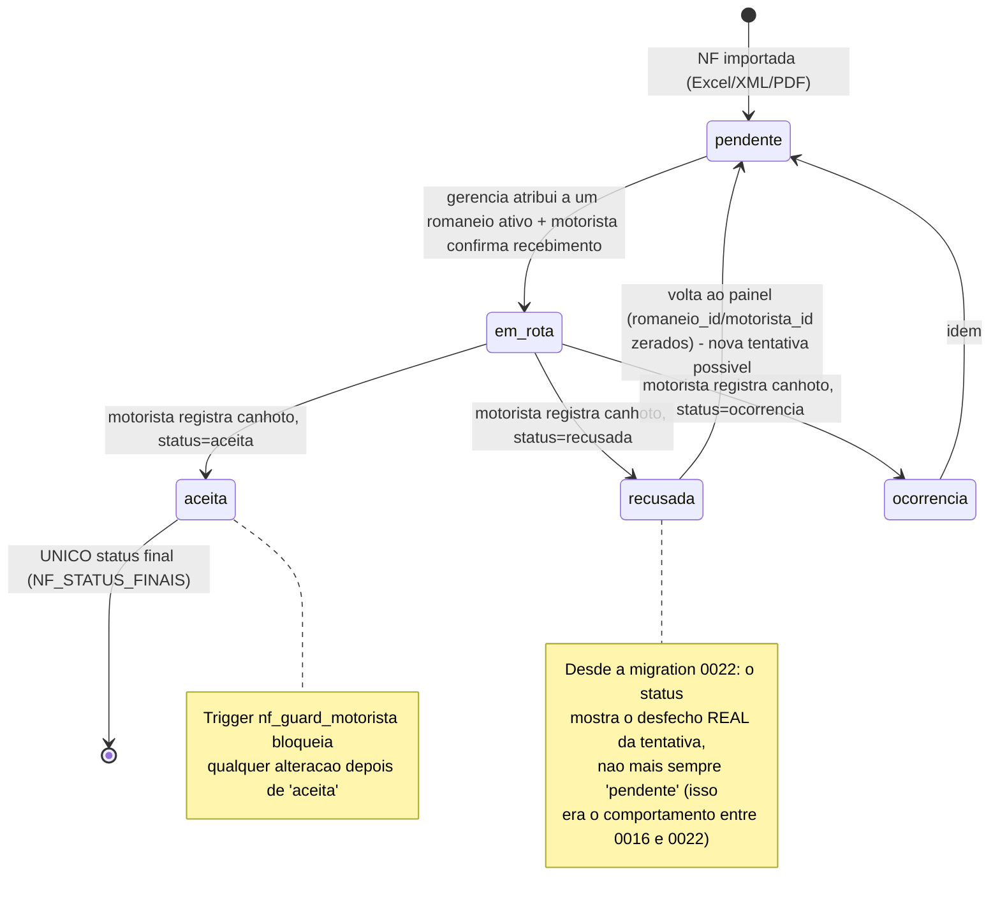

# 17 — Diagramas de Arquitetura

Ver também: diagrama ER completo em `09_DATABASE_SCHEMA_FROM_MIGRATIONS.md`, sequência de login em `12_AUTH_AND_AUTHZ.md`. Este arquivo cobre os 3 diagramas que não couberam nos anteriores.

## 1. Arquitetura geral do sistema

## 2. Sequência: registro de entrega, do celular ao banco

O caminho mais percorrido do sistema — e o que teve os 2 bugs de RLS documentados em `10_RLS_AND_SECURITY.md`.

## 3. Máquina de estados de uma NF (`NotaStatus`)

O comportamento mudou 2 vezes de forma consequente (migrations 0016 e 0022) — vale visualizar o estado atual explicitamente, porque a intuição "recusada/ocorrência = final" (comum em outros sistemas de entrega) é **errada** neste projeto desde a A-007.

**Nota de leitura:** as transições `recusada --> pendente` e `ocorrencia --> pendente` não significam "o status muda para pendente automaticamente" — significam "a NF fica **disponível para nova tentativa**, e uma nova tentativa começa do zero (nova atribuição de romaneio/motorista), então o próximo ciclo começa em `pendente`". O `status` da NF em si permanece mostrando `recusada`/`ocorrencia` até alguém agir de novo — é assim que a gerência sabe o que aconteceu sem abrir o comprovante.
