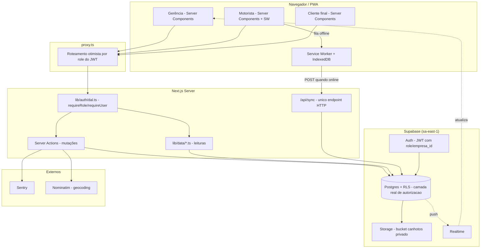

# Checkpoint Técnico — Aliança Log

> **O que é este documento.** Um raio-x do sistema **a partir do código**, não do histórico de decisões.
> Gerado seguindo a metodologia de `PROMPT_GENERIC_PROJECT_CHECKPOINT.md` (detecção de stack → rotas →
> componentes → dados → schema → auth → integrações → observabilidade → testes → dívida técnica),
> condensada num arquivo só — este projeto não justifica os 14 arquivos separados que o prompt genérico
> sugere para sistemas grandes, e `CLAUDE.md` pede para não criar arquivos além do necessário.
>
> **Isto não substitui o [CHECKPOINT.md](../governanca/CHECKPOINT.md)** (o diário de sessão, "o que mudou e por quê",
> atualizado a cada sessão). Este arquivo é o inverso: "o que existe e onde", verificado direto no código,
> para uma IA ou dev novo entender a arquitetura real em minutos. **Não é atualizado a cada sessão** —
> regenere quando a arquitetura mudar de forma relevante (nova tabela, novo perfil, nova integração).

**Gerado em:** 2026-08-28 · **Commit:** `d2756ae` (branch `main`) · **Fonte de verdade:** código-fonte, não documentação anterior.

---

## 0. Detecção de stack

| Campo | Valor | Evidência |
|---|---|---|
| Tipo de projeto | Fullstack (PWA) | `app/` + `app/api/sync/route.ts` |
| Linguagem | TypeScript | `tsconfig.json` |
| Framework | Next.js 16.2.9 (App Router) | [package.json](../../package.json) |
| UI | React 19.2.4 + Tailwind v4 | [package.json](../../package.json) |
| Package manager | pnpm 10 no deploy; npm também suportado localmente | `pnpm-lock.yaml`, `package-lock.json`, configuração da Vercel |
| Node exigido | ≥24 | [package.json](../../package.json) `engines`, [.nvmrc](../../.nvmrc) |
| Database | PostgreSQL via Supabase, região `sa-east-1` | `supabase/migrations/`, [README.md](../../README.md) |
| ORM | Nenhum — SQL puro em migrations + `@supabase/supabase-js`/`pg` direto | `lib/supabase/*.ts`, `scripts/migrate.mjs` |
| Auth | Supabase Auth (JWT) + `@supabase/ssr` | `lib/supabase/{client,server,proxy,admin}.ts` |
| Build tool | Turbopack (padrão do Next 16) | implícito no `next build` |
| Test runner | Script Node próprio (sem framework) | `scripts/smoke-seguranca.mjs` |
| Deploy | Vercel (inferido — HTTPS exigido por câmera/SW, sem `vercel.json` pois usa zero-config) | [CHECKPOINT.md](../governanca/CHECKPOINT.md), ausência de config = padrão Vercel para Next.js |
| Observabilidade | Sentry (`@sentry/nextjs`) | `sentry.*.config.ts`, `instrumentation.ts` |
| PWA | Service Worker próprio (cache estático + Background Sync) + manifest via App Router | `public/sw.js`, `app/manifest.ts` |

**Nota sobre lockfiles:** a Vercel detecta e usa `pnpm-lock.yaml` com instalação
congelada; ele precisa acompanhar toda mudança de dependências no `package.json`.
Os scripts também funcionam via npm no ambiente local.

---

## 1. Dependências principais

| Pacote | Versão | Papel |
|---|---|---|
| `next` | 16.2.9 | Framework — App Router, Server Actions, Server Components |
| `react` / `react-dom` | 19.2.4 | UI |
| `@supabase/supabase-js` + `@supabase/ssr` | 2.108.2 / 0.12.0 | Cliente DB/Auth/Realtime/Storage — `ssr` (não `auth-helpers-nextjs`, descontinuado) |
| `pg` | 8.20.0 | Conexão direta ao Postgres para scripts de infra (`migrate.mjs`, `backup.mjs`, `smoke-seguranca.mjs`) — via `DATABASE_URL`, fora do RLS |
| `@sentry/nextjs` | 10.71.0 | Error tracking + session replay |
| `@tabler/icons-react` | 3.45.0 | Ícones de toda a UI (regra: nunca emoji, ver `CLAUDE.md`) |
| `@zxing/library` | 0.23.0 | Fallback do scanner de código de barras quando `BarcodeDetector` nativo não existe |
| `leaflet` + `react-leaflet` | 1.9.4 / 5.0.0 | Mapa de entregas (dashboard da gerência + motorista) |
| `xlsx` (SheetJS, via CDN da própria SheetJS) | 0.20.3 | Parser de planilha na importação de romaneio — carregado sob demanda (`import("xlsx")`) |
| `pdfjs-dist` | 6.1.200 | Extração best-effort de dados de DANFE em PDF |
| `fflate` | 0.8.3 | Descompactar `.zip` de XMLs na importação em lote |
| `zod` | 4.4.3 | Validação de input |

**Scripts** ([package.json](../../package.json)):

| Script | Faz |
|---|---|
| `dev` / `build` / `start` | Ciclo padrão Next.js |
| `lint` / `typecheck` | ESLint / `tsc --noEmit` |
| `test` | `typecheck && lint && test:security` — não roda `build` |
| `test:security` | `scripts/smoke-seguranca.mjs` — suíte de RLS/autorização contra o banco real |
| `seed` | Popula dados fictícios (`scripts/seed.mjs`) |
| `db:migrate` / `db:status` / `db:backup` | Runner de migrations, status vs. aplicado, dump de schema |
| `db:setup-sql` | Concatena `supabase/migrations/*.sql` num `setup.sql` único (não usado em produção, é para bootstrap rápido de ambiente novo) |

---

## 2. Rotas (App Router) — 18 rotas de página + 1 API

| Rota | Perfil | Arquivo | Notas |
|---|---|---|---|
| `/` | — | `app/page.tsx` | Redireciona por role via `proxy.ts` |
| `/login` | público | `app/login/page.tsx` | |
| `/gerencia/dashboard` | gerência | `app/gerencia/dashboard/page.tsx` | Home da gerência — KPIs, lista de NFs, mapa |
| `/gerencia/romaneios` | gerência | `app/gerencia/romaneios/page.tsx` | Lista |
| `/gerencia/romaneios/novo` | gerência | `app/gerencia/romaneios/novo/page.tsx` | Criação por câmera |
| `/gerencia/romaneios/[id]` | gerência | `app/gerencia/romaneios/[id]/page.tsx` | Detalhe + fechamento |
| `/gerencia/importar` | gerência | `app/gerencia/importar/page.tsx` | Excel/XML/PDF |
| `/gerencia/cadastros` | gerência | `app/gerencia/cadastros/page.tsx` | Motoristas/empresas/veículos |
| `/motorista/entregas` | motorista | `app/motorista/entregas/page.tsx` | Home do motorista — "Minhas entregas" |
| `/motorista/romaneio/[id]` | motorista | `app/motorista/romaneio/[id]/page.tsx` | Lista de NFs do romaneio |
| `/motorista/canhoto/[id]` | motorista | `app/motorista/canhoto/[id]/page.tsx` | Registro de entrega/ocorrência |
| `/motorista/historico` | motorista | `app/motorista/historico/page.tsx` | Romaneios passados, read-only |
| `/cliente/notas` | cliente_final | `app/cliente/notas/page.tsx` | Home do cliente — lista + progresso |
| `/cliente/importar` | cliente_final | `app/cliente/importar/page.tsx` | Cliente importa as próprias NFs |
| `/api/sync` | motorista (via API) | `app/api/sync/route.ts` | Único endpoint de API real do sistema — recebe fila offline do celular |

**Layouts:** `app/layout.tsx` (raiz) + um por área (`gerencia/`, `motorista/`, `cliente/`) — cada um provavelmente chama `requireRole()` (ver §7).

**Padrão arquitetural:** isto é essencialmente **zero API REST tradicional** — toda mutação de dado passa por **Server Actions** (arquivos `actions.ts` dentro de cada rota, ex. `app/gerencia/dashboard/actions.ts`, `app/gerencia/romaneios/actions.ts`, `app/gerencia/cadastros/actions.ts`), não por `route.ts`. A única exceção é `/api/sync`, que existe como rota HTTP porque é chamada pelo **Service Worker fora do contexto de React** (fila do IndexedDB, sem acesso a Server Actions).

---

## 3. Componentes — por área

| Pasta | Arquivos | Papel |
|---|---|---|
| `components/gerencia/` | 14 | Dashboard, importação, romaneios, cadastros, mapa, painel por cliente |
| `components/motorista/` | 10 | Entregas, canhoto, histórico, offline (SW register, sync banner), posição GPS |
| `components/cliente/` | 5 | Portal do cliente — lista, filtros, hero |
| `components/ui/` | 7 | Design system genérico — `dark-shell`, `kpi`, `modal`, `pill`, `progress`, `timeline` |
| `components/mapa/` | 1 | `leaflet-map.tsx` — wrapper único do Leaflet, reusado por gerência e motorista |
| `components/brand/` | 1 | `logo.tsx` |
| `components/` (raiz) | 3 | `app-shell.tsx`, `comprovante-modal.tsx` (compartilhado gerência+cliente), `logout-button.tsx` |

**Maiores (candidatos a split — ver §11 dívida técnica):** [notas-list.tsx](../../components/gerencia/notas-list.tsx) (602 linhas), [import-wizard.tsx](../../components/gerencia/import-wizard.tsx) (510 linhas).

---

## 4. Data access map — `lib/data/*.ts`

Toda leitura passa por aqui (Server Components chamam essas funções direto, sem passar por API). Todas usam o cliente Supabase autenticado da sessão (`lib/supabase/server.ts`) — **o RLS do Postgres filtra, a função não precisa repetir a checagem de empresa/motorista**.

| Arquivo | Funções | Tabelas tocadas |
|---|---|---|
| `lib/data/gerencia.ts` (303 linhas) | `getResumoHoje`, `getNotasDoDia`, `getPainelClientes`, `listEmpresas`, `listMotoristas`, `listVeiculos` | `notas_fiscais`, `canhotos`, `empresas_clientes`, `motoristas`, `veiculos` |
| `lib/data/motorista.ts` | `getRomaneiosDoDia`, `getHistoricoRomaneios`, `getNotasDoRomaneio`, `getNota` | `romaneios`, `notas_fiscais` |
| `lib/data/cliente.ts` | `getNotasCliente` | `notas_fiscais` (filtrado por `empresa_id` via RLS) |
| `lib/data/romaneios.ts` | `listRomaneios`, `getRomaneio`, `contarPendentes` | `romaneios`, `notas_fiscais` |
| `lib/data/mapa.ts` | `getDestinosGeocodificados`, `contarDestinosPendentesDeGeocode`, `getEntreguesComGps`, `getPosicoesMotoristas` | `notas_fiscais` (lat/lng destino), `canhotos` (lat/lng GPS), `motorista_posicao` |
| `lib/data/comprovante.ts` | `getComprovante` | `notas_fiscais`, `canhotos`, `ocorrencias` — compartilhado entre gerência e cliente (cada um aplica seu próprio `requireRole` antes) |

**Mutações** vivem em `actions.ts` por rota (Server Actions), não em `lib/data/` — separação leitura (lib/data) vs. escrita (actions colocation com a rota).

---

## 5. Schema do banco — 10 tabelas, 23 migrations

```
empresas_clientes → usuarios → motoristas
                              ↘ veiculos
romaneios → notas_fiscais → canhotos
                          ↘ ocorrencias
import_batches       (rastreabilidade de importação legada, esqueleto)
motorista_posicao    (1 linha por motorista, GPS ao vivo)
```

**Cronologia das migrations** (evidência: `supabase/migrations/`):

| # | O que fez |
|---|---|
| 0001 | Schema base (as 8 tabelas centrais) |
| 0002 | RLS habilitado em tudo + `jwt_role()`/`jwt_empresa_id()` (funções auxiliares que leem `app_metadata` do JWT) |
| 0003 | Bucket `canhotos` no Storage (privado) |
| 0004 | Realtime habilitado |
| 0005 | `chave_acesso` (NF-e) + GPS do canhoto |
| 0006–0007 | Correção de índice/upsert do Storage (bug de sync 500) |
| 0008 | `retida` deixa de ser status de NF, vira tipo de ocorrência; cliente pode importar (`cli_nf_insert`) |
| 0009 | Sync idempotente por `client_id` + imutabilidade de NF finalizada (`nf_guard_motorista`) |
| 0010 | Dia operacional em fuso de SP (`hoje_sp()`) — RLS e app paravam de bater à noite |
| 0011 | `registrar_entrega_offline()` — canhoto + update NF + ocorrência numa transação só |
| 0012 | Storage endurecido (path por `auth.uid()`, limite 5MB, MIME) |
| 0013 | `import_batches` (rastreabilidade de legado — esqueleto, nunca usado de fato) |
| 0014 | Geocodificação do endereço da NF (`lat`/`lng`/`geocode_status`) |
| 0015 | Histórico do motorista — relaxa `mot_nf_select` pra além de "hoje" |
| 0016 | **Reentrega**: idempotência muda de "por NF" pra "por tentativa" (`client_id`), permite múltiplos canhotos por NF |
| 0017 | `motorista_posicao` — GPS ao vivo, trigger no servidor cronometra (não confia no relógio do celular) |
| 0018 | `foto_chegada_url` — segunda foto obrigatória antes do canhoto |
| 0019 | `geocode_erro` — motivo da falha de geocodificação, permite reprocessar |
| 0020 | Motorista pode ver a própria ocorrência mesmo após a NF sair do seu romaneio |
| 0021 | Motorista mantém acesso ao histórico após a NF ser devolvida ao painel (`motorista_registrou_nf()`) |
| 0022 | Ocorrência passa a ser status visível separado no painel da gerência (não mais "pendente") |
| 0023 | Backfill de desfechos legados + confirmação atômica do romaneio pelo motorista |

**Modelo de autorização em 3 camadas** (nenhuma delas sozinha é suficiente):
1. `proxy.ts` — checagem **otimista** por role do JWT, sem tocar o banco (UX: evita flash de conteúdo errado)
2. `lib/auth/dal.ts` — `requireRole()`/`requireUser()` em Server Components, roda no servidor
3. **RLS no Postgres** (`0002_rls.sql` + ajustes posteriores) — a camada real. Padrão: `ger_all` (gerência vê/edita tudo), `mot_*` (motorista só o que é seu — `motorista_id = auth.uid()`), `cli_*` (cliente só a própria `empresa_id` via `jwt_empresa_id()`)

**Funções de banco não triviais:**
- `registrar_entrega_offline()` (0011, reescrita em 0016/0018/0022) — o coração do fluxo offline, uma transação que grava canhoto + atualiza NF + lança ocorrência
- `nf_guard_motorista()` (trigger, 0009/0016) — bloqueia motorista de editar NF finalizada ou campos fora do permitido
- `hoje_sp()` (0010) — dia-calendário de São Paulo, usado tanto no app quanto na RLS
- `motorista_registrou_nf()` (0021) — permite acesso histórico a uma NF que já não pertence mais ao motorista

---

## 6. Autenticação e autorização

Ver diagrama §8. Resumo: **3 roles fixos** (`gerencia`, `motorista`, `cliente_final`), armazenados em `app_metadata` do JWT (não editável pelo cliente — só quem cria o login via `service role key` define o role, em `lib/supabase/admin.ts`). Nenhum RBAC granular além disso — é role simples, não permissões compostas.

**Sem OAuth/terceiros** — login é email+senha direto no Supabase Auth.

---

## 7. Integrações externas

| Integração | Uso | Onde |
|---|---|---|
| Supabase (DB+Auth+Realtime+Storage) | Backend inteiro | `lib/supabase/*.ts` |
| Sentry | Error tracking + session replay (100% trace sample, 10% session replay, 100% em erro) | `sentry.*.config.ts` — **depende de `NEXT_PUBLIC_SENTRY_DSN` estar setada; sem ela, `enabled: false` e não envia nada** |
| Nominatim (OpenStreetMap) | Geocodificação de endereço, gratuito, rate limit 1 req/s | `lib/geocode.ts` |
| Google Maps (deep link, não API) | "Abrir no Maps" no celular do motorista | `lib/maps.ts` |
| `BarcodeDetector` nativo + `@zxing/library` (fallback) | Scanner de código de barras do DANFE | `components/gerencia/barcode-scanner.tsx` |
| SheetJS (`xlsx`) | Parser de planilha, client-side, sob demanda | importação de romaneio |
| `pdfjs-dist` | Extração best-effort de DANFE em PDF | `lib/import-nf.ts` |

**Não há:** gateway de pagamento, envio de email/SMS, fila externa (Redis/SQS), CDN de imagem além do Storage do Supabase.

---

## 8. Observabilidade

- **Logging:** nenhum logger estruturado — `console.log`/`console.error` implícitos + Sentry para exceções
- **Health check:** não existe endpoint `/health` ou `/api/health`
- **CI:** existe **um único workflow** ([.github/workflows/db-backup.yml](../../.github/workflows/db-backup.yml)) — backup diário do banco (`pg_dump` agendado, 06:00 UTC). **Não há CI que rode `build`/`typecheck`/`lint`/`test:security` a cada push ou PR** — essas checagens hoje só rodam manualmente, na máquina de quem está codando.
- **Monitoramento de erro em produção:** depende inteiramente do Sentry estar configurado com DSN válida no ambiente de deploy — não verificado neste checkpoint se está de fato ativo em produção (variável de ambiente, não código).

---

## 9. Testes

**Não há framework de teste** (Jest/Vitest/Playwright) instalado — Playwright está planejado (Sprint 4) mas não implementado.

**O que existe:** [scripts/smoke-seguranca.mjs](../../scripts/smoke-seguranca.mjs) (reescrito em 2026-08-28, ver [CHECKPOINT.md](../governanca/CHECKPOINT.md)) — script Node autoral, roda contra o **banco real de produção**, autenticando como cada role de verdade (não usa a service role para simular — motivo: um teste com admin não discrimina RLS quebrado de RLS correto, foi exatamente o bug do antigo "T7"). **21 verificações** organizadas em blocos:

| Bloco | Cobre |
|---|---|
| T1–T3 | Destinatário imutável pelo motorista, ciclo básico de finalização, imutabilidade pós-aceite |
| T4a–c | Múltiplas tentativas de entrega (reentrega), idempotência por `client_id` |
| T5–T6 | Motorista não acessa NF/romaneio de outro; romaneio fechado não reabre |
| T7a–c | Sync idempotente ponta-a-ponta (grava, no-op em retry, não duplica) |
| T8a–e | Ciclo de ocorrência: registra, NF muda de status, volta ao painel, motorista mantém histórico, isolamento entre motoristas |
| T9a–d | **R-008 — isolamento entre empresas** (cliente só vê a própria empresa, não cria para outra, não vê ocorrência alheia) |

O script tem **auto-limpeza garantida por `try/finally`** (mesmo se um teste falhar no meio, os dados de teste não ficam presos no banco de produção) — corrigido nesta mesma sessão, era um risco real antes.

**Gaps confirmados:** 0% de testes de componente/unitário: 0 testes E2E de fluxo completo (login → import → bipagem → entrega); nenhuma cobertura de código medida (não há ferramenta de coverage instalada).

---

## 10. Diagrama de arquitetura



---

## 11. Dívida técnica e riscos (verificado no código, 2026-08-28)

| Achado | Severidade | Evidência |
|---|---|---|
| `notas-list.tsx` com 602 linhas, `import-wizard.tsx` com 510 | Baixa/média | Excede o limite de 500 linhas do `CLAUDE.md` — candidatos a split, sem urgência funcional |
| CI só cobre backup, não build/test/lint | Média | `.github/workflows/db-backup.yml` é o único workflow; nenhum roda em push/PR |
| `pnpm-lock.yaml` versionado mas não usado | Baixa | Projeto usa npm; lockfile órfão pode confundir setup de ambiente novo |
| 0% de testes automatizados além do smoke de segurança | Média | Sem Jest/Vitest/Playwright — regressão de UI só é pega manualmente |
| `import_batches`/rastreabilidade de legado (0013) nunca usado | Baixa | Esqueleto preparado, nenhuma importação de legado rodou de fato até hoje |
| Sem endpoint de health check | Baixa | Dificulta monitoramento externo de uptime |
| **Risco de ambiente:** projeto historicamente rodava dentro do OneDrive | Foi resolvido nesta sessão | Ver nota abaixo — `CHECKPOINT.md` ainda cita o caminho antigo, corrigido separadamente |

**Riscos de produto já rastreados em outros documentos** (não duplicados aqui): `R-008` isolamento entre empresas (coberto pelos testes T9, ver §9), offline-first parcial (só funciona se a aba já estava aberta), rota/otimização de múltiplas paradas não implementada. Ver [PLAN.md](../governanca/PLAN.md) e [CHECKLIST.md](../governanca/CHECKLIST.md) para o levantamento de produto completo — este documento cobre só o que é visível estruturalmente no código.

---

## 12. Perguntas em aberto

1. **Sentry está de fato ativo em produção?** O código só ativa se `NEXT_PUBLIC_SENTRY_DSN` existir no ambiente de deploy — não verificável a partir do repositório local.
2. **`import_batches` (0013) tem plano concreto de uso**, ou é esqueleto morto que deveria ser removido/revisitado?
3. **Vale formalizar o CI de build/lint/test** (hoje só existe o de backup) antes ou depois do primeiro piloto real?
4. `pnpm-lock.yaml` pode ser removido com segurança, ou alguém do time ainda usa pnpm localmente?

---

## Como isto foi gerado

Inventário extraído direto do código nesta sessão (2026-08-28): `package.json`, árvore de `app/`/`components/`/`lib/`, todas as 23 migrations em `supabase/migrations/`, `proxy.ts`, `lib/auth/dal.ts`, contagem real de linhas e de verificações do smoke test, workflows em `.github/`. Nenhuma afirmação deste documento veio de memória ou de documentação anterior sem confirmação no código — onde a documentação anterior (`CHECKPOINT.md`) tinha uma informação desatualizada (localização do repositório, ver nota de ambiente lá), foi corrigida diretamente nele, não aqui.
